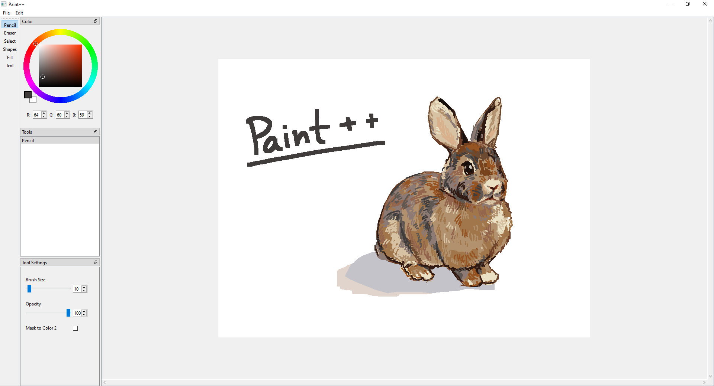

<h1> Paint++ </h1>

 Download the built version [here](https://drive.google.com/file/d/1dBqf7wfbJktYYetcV5FtE9B7cjL87UxQ/view?usp=sharing)!

## Table of Contents

- [Intro](#intro)
- [Features](#features)

## Intro 
Paint++ is a basic graphics editor desktop application for Windows inspired by MSPaint. It can be run by running the executable stored inside the .zip file linked above.

## Features 
- Quickly change colors with Paint++'s square color wheel or pick them from the image by right clicking on a given area
- Draw and erase lines with the Pencil and Eraser tools
- Move, rotate, and scale parts of the image with the Select tool
- Draw a variety of shapes and perfect lines with the Shape tools
- Easily fill in areas with the Fill Bucket tool
- Label your images with the Text tool
- Save your images as .jpg or .png files and open them for later editing
